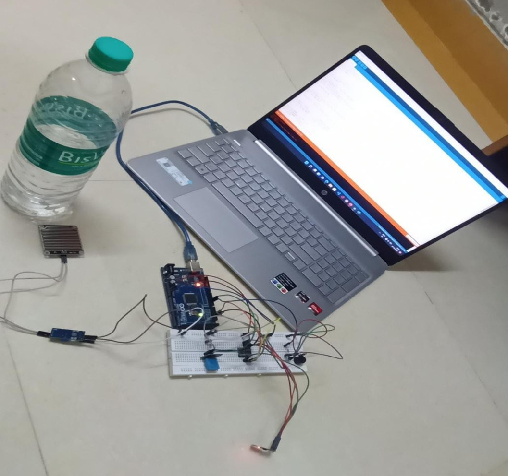

# Water-Leakage-Detection-System
<!--
This project aims to develop an Arduino-based water leakage detection system for residential areas. The system is designed to monitor water leakage automatically, making it cost-effective and efficient. The system uses the Agile model, which is well-suited for dealing with the demands of connected devices. Testing is an important element of each stage of the development process, and the Agile model helps adjust the approach to target high-priority issues. The system is designed to be secure, continuous, and reliable, reducing the need for field monitoring. The system also allows for remote data monitoring and control, saving lives and avoiding unpleasant scenarios. The system is designed to be cost-effective, convenient, and fast, preventing water waste and ensuring safety.
-->
## Overview

This project aims to develop an Arduino-based water leakage detection system for residential areas. The system is designed to monitor water leakage automatically, making it cost-effective and low-cost. The system does not require manual labor and is designed to avoid water waste from uncontrolled use in homes and offices.
## Development Methodology

The model is used in the development of this IoT project, making it easier to adjust the approach to target high-priority issues. The iterative and incremental development process allows for flexibility in responding to changing requirements and ensures a more adaptive and efficient development lifecycle.

## Development Environment

- **Arduino Platform:** The project is developed using the Arduino platform, making it accessible and easy to implement.

- **IoT Integration:** The system leverages Internet of Things (IoT) technology for seamless connectivity and remote monitoring.

## Getting Started

1. **Hardware Requirements:**
   - Arduino Board
   - Water Level Sensors
   - Communication Module (e.g., Wi-Fi, GSM)
   - Power Supply

2. **Software Requirements:**
   - Arduino IDE
   - IoT Platform (for remote monitoring)

3. **Installation:**
   - Connect the hardware components as per the provided schematic.
   - Upload the Arduino code to the board using the Arduino IDE.
   - Configure the IoT platform for remote monitoring.

4. **Usage:**
   - Power on the system.
   - Monitor the real-time data on the designated IoT platform.

<!--## Contributing

Contributions are welcome! If you have suggestions, enhancements, or bug fixes, please submit a pull request.-->

## Conclusion

This system identifies and alerts about leaks in water supply or plumbing systems to prevent water wastage and potential damage to property.

